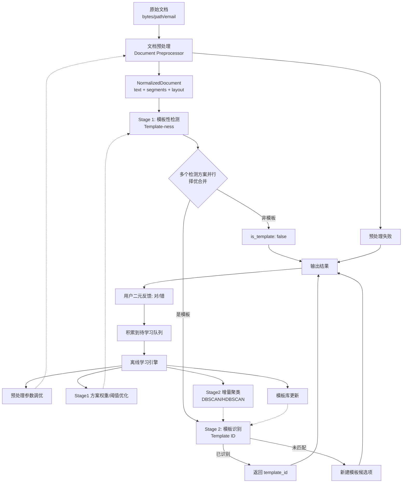
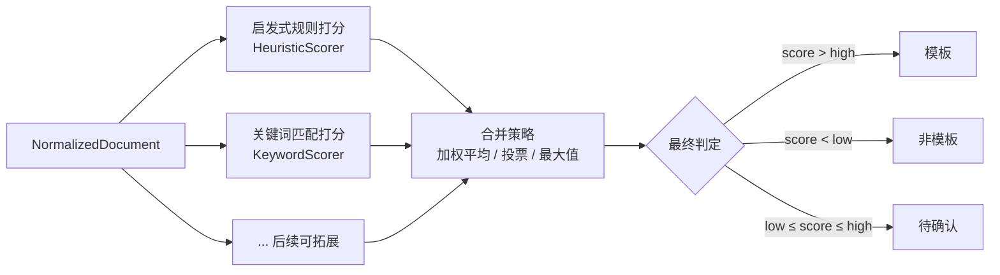

# 模板文档检测

## 目标

给定一份电子文档，判断其是否由模板生成。如果是由模板生成的，进一步识别其所属的模板类型（template_id）。

## 核心问题

模板检测的本质是区分 **人工编写文档** 与 **模板生成文档**，而非对文档做精细语义理解。关键洞察：

- 模板生成文档具有高度结构化特征：固定文本区域多、可变字段占比小且位置固定、布局重复性高
- 人工编写文档则文本自由、格式灵活、重复模式少

## 方案限制

- **无预训练/无预标注数据**：系统上线后直接面对未知文档，不存在离线预训练阶段，只能在处理过程中积累和学习
- **仅二元反馈**：对于分类结果，用户只能确认"对/错"，无法提供正确的 template_id。这意味着如果判定为模板 A 但用户说"错"，无法区分是"不是模板"还是"是模板但类型不对"
- **数据集仅用于模拟反馈**：项目提供的数据集可模拟上线后用户的确认结果，用于评估方案有效性，但不可用于预训练
- **不使用 LLM**：不能依赖外网模型，也没有本地 GPU 集群，只能使用传统 ML/DL 或可在普通 CPU 服务器上运行的算法
- **异步学习**：数据积累和模板库更新可以分离 —— 在线即时积累数据，空闲时批量学习更新

## 方案设计

### 整体架构：预处理 + 两阶段管线



### 文档预处理 (Document Preprocessing)

将各种格式的原始文档转换为统一的 `NormalizedDocument` 结构，供下游所有检测方案共享。

#### 输入

原始文档的多种形态：

| 来源 | 原始格式 | 说明 |
|------|----------|------|
| 邮件文件 | `.eml` / `.msg` | 需解析正文（HTML/plain）及附件 |
| 办公文档 | `.pdf` / `.docx` / `.pptx` | 直接解析或转中间格式 |
| 扫描件/图片 | `.jpg` / `.png` / `.tiff` | 需 OCR 识别文字 |
| 网页 | `.html` / `.mhtml` | 需提取正文并去噪 |
| 纯文本 | `.txt` / `.csv` / `.json` | 轻量解析 |

#### 处理管线

预处理由一组可扩展的 Processor 串联构成，每个 Processor 负责一种特定的转换：

```
原始文档 → [FormatDetector] → 格式分发
  ├── EmailParser    (.eml/.msg)  → 提取正文 + 附件 → 递归处理附件
  ├── OcrProcessor   (图片/扫描件) → OCR → 文本 + 坐标
  ├── PdfProcessor   (.pdf)       → 布局分析 → 文本块 + bbox
  ├── HtmlProcessor  (.html)      → 正文提取 → Markdown / 纯文本
  ├── DocxProcessor  (.docx)      → 段落解析 → 文本块
  └── TextProcessor  (.txt/.csv)  → 基础分块
       │
       ▼
  [StructureAnalyzer]             → 段落树、标题层级、表格结构
       │
       ▼
  NormalizedDocument              → 统一输出
```

#### 输出：NormalizedDocument

```python
@dataclass
class NormalizedDocument:
    source_path: str | None        # 原始文件路径
    source_format: str             # 原始格式标识 (pdf/eml/docx/html/txt/…)
    raw_text: str                  # 纯文本全文（OCR 或解析所得）
    segments: list[TextSegment]    # 文本块列表（含位置信息）
    structure: DocumentStructure   # 文档结构树（标题层级、段落、表格）
    metadata: dict                 # 来源信息、页数、解析耗时等
    preprocessing_log: list[str]   # 经过的预处理步骤记录

@dataclass
class DocumentStructure:
    title: str | None
    headings: list[HeadingInfo]    # 标题层级
    paragraphs: list[int]          # 段落对应的 segment 索引
    tables: list[TableInfo]        # 表格结构

@dataclass
class TextSegment:
    text: str
    bbox: tuple[float, float, float, float] | None  # (x0, y0, x1, y1)
    font_size: float | None
    is_heading: bool = False
    role: str = "body"             # heading / body / header / footer / table_cell
```

预处理过程应保留完整的解析链路记录（`preprocessing_log`），方便后续排查和调优。

#### 设计要点

- **可插拔**：每个 Processor 实现统一接口，可独立添加/移除/替换
- **容错**：某个 Processor 失败不应阻塞整个管线，应降级并记录日志
- **共享复用**：预处理输出的 `NormalizedDocument` 同时供给 Stage 1 的多个检测方案使用，避免重复解析
- **可拓展**：后期可通过离线学习优化预处理参数（如 OCR 语言模型选择、PDF 解析精度配置）

### Stage 1：模板性检测

目标：判断文档是否由模板生成，输出 `is_template: bool` + `confidence: float`。

Stage 1 内部可运行**多个检测方案**（scorer），每个方案独立计算模板性分数，最终通过策略合并择优：



#### 内置方案 1：启发式规则打分 (HeuristicScorer)

每个维度输出 0~1 分，加权求和得到模板性分数：

| 特征维度 | 计算方式 | 说明 |
|----------|----------|------|
| **固定文本占比** | 去重 n-gram 占比 / 总文本长度 | 模板文档中大量文本跨文档重复 |
| **布局规律性** | 文本块对齐一致性、行间距方差倒数 | 模板文档布局高度规整 |
| **特殊字符密度** | 数字、标点、分隔符占总字符比例 | 模板文档含大量结构化字段（金额、日期、编号） |
| **重复模式密度** | 正则匹配到的类字段模式（`\d{4}-\d{2}-\d{2}` 等） | 模板文档中日期、金额等模式反复出现 |
| **文本熵** | 字符级/词级信息熵 | 模板文档中固定部分导致熵偏低 |

**判定规则**：

```
template_ness = Σ(w_i * score_i)  // 加权求和
if template_ness > threshold_high  → 判定为模板
if template_ness < threshold_low   → 判定为非模板
else → 低置信度，标记待确认
```

**设计要点**：
- 零数据即可运行，所有特征无需训练
- 权重和阈值初期可手工设定，后续通过离线学习优化
- 产出 confidence 供下游决策（如自动通过 / 标记人工审核）

#### 内置方案 2：关键词匹配打分 (KeywordScorer)

对已知模板类型中出现的强特征关键词/正则做匹配计数，归一化为分数：

```
score = (matched_patterns / total_patterns) * boost_if_cluster
```

例如已知模板中出现的高频模式：`"账单日期"`、`"本期应还款金额"`、`"信用卡账单"` 等。随着模板库的积累，各模板的 Pattern 集可通过离线学习自动提取。

#### 合并策略

| 策略 | 适用场景 |
|------|----------|
| **加权平均** | 各方案独立且互补，根据历史准确率分配权重 |
| **最大值** | 任何一个方案高置信度即可判定（降低漏判） |
| **投票** | 多个方案输出等权的 0/1 判定，取多数 |
| **级联** | 先跑低成本方案，低置信度时再跑高成本方案 |

合并策略可通过离线学习根据历史反馈数据自动选择或调参。

### Stage 2：模板识别

目标：对 Stage 1 判为模板的文档，识别其具体模板类型。

#### 在线匹配

1. 提取文档"指纹"特征向量（文本 TF-IDF + 布局特征）
2. 与模板库中已有 `TemplateProfile` 计算相似度
3. 最高相似度 > 阈值 → 返回对应 `template_id`
4. 否则 → 创建一个新的模板候选项（临时 ID），积累足够同类文档后经离线聚类确认

#### 离线学习

利用积累的文档 + 用户反馈，定期（如每日/每周）批量执行：

**步骤 1：确认模板文档池**
- 从待学习队列中筛选出用户确认为"对"的模板文档
- 对于用户确认为"错"的文档：若其 `is_template=true`，则降级为待定或丢弃（因无法确定正确模板类型）

**步骤 2：聚类发现模板类型**
- 对确认的模板文档集合做聚类（如 DBSCAN / HDBSCAN，无需预设 K 值）
- 每个簇对应一个模板类型
- 对于规模达到阈值的簇，创建/更新 `TemplateProfile`
- 噪点文档保留为候选项，待后续更多数据

**步骤 3：规则调优**
- 利用累计数据优化 Stage 1 的权重和阈值
- 方法：在积累数据上搜索最优参数组合（网格搜索 / 贝叶斯优化）

#### 自我演化示例

```
T0: 系统上线，模板库为空
    → 所有文档进入 Stage 1，依赖规则打分判定模板性
    → 判为模板的文档在 Stage 2 均进入"新建候选项"

T1: 积累了一批经用户确认为"对"的模板文档
    → 离线聚类发现 3 个簇 → 创建 3 个 TemplateProfile
    → 更新模板库

T2: 新文档进入 Stage 2，与 3 个已知模板匹配
    → 命中 → 返回模板 ID
    → 未命中 → 继续创建候选项

T3: 积累更多数据，再次离线聚类
    → 原有 3 个模板得到强化，新增 1 个模板
    → Stage 1 阈值根据反馈数据自动微调
```

### 反馈处理策略

| 系统输出 | 用户反馈 | 处理逻辑 |
|----------|----------|----------|
| `{is_template: true, id: "A"}` | 对 | 确认文档归入模板 A，加入待学习队列 |
| `{is_template: true, id: "A"}` | 错 | 无法确定是"非模板"还是"模板类型错误"，标记为待定，不用于模板学习 |
| `{is_template: false}` | 对 | 确认非模板，丢弃 |
| `{is_template: false}` | 错 | 确认是模板但未识别出类型，加入待学习队列（作为模板候选项，但 template_id 未知） |

## 数据结构

```python
@dataclass
class RawDocument:
    """预处理前的原始文档。"""
    source: str | bytes               # 文件路径或字节流
    source_format: str                # pdf / eml / docx / html / image / txt
    metadata: dict                    # 文件名、大小、mime type 等

@dataclass
class NormalizedDocument:
    """预处理后的统一文档表示，供下游所有检测方案共享。"""
    source_path: str | None
    source_format: str
    raw_text: str                     # 纯文本全文
    segments: list[TextSegment]       # 文本块列表（含位置信息）
    structure: DocumentStructure      # 文档结构树
    metadata: dict
    preprocessing_log: list[str]      # 经过的预处理步骤

@dataclass
class DocumentStructure:
    title: str | None
    headings: list[HeadingInfo]
    paragraphs: list[int]
    tables: list[TableInfo]

@dataclass
class HeadingInfo:
    text: str
    level: int                        # 1/2/3...
    segment_index: int

@dataclass
class TableInfo:
    headers: list[str]
    rows: list[list[str]]
    bbox: tuple[float, float, float, float] | None

@dataclass
class TextSegment:
    text: str
    bbox: tuple[float, float, float, float] | None
    font_size: float | None
    is_heading: bool = False
    role: str = "body"                # heading / body / header / footer / table_cell

@dataclass
class ScorerResult:
    """单个检测方案的输出。"""
    scorer_name: str
    score: float                      # 0~1
    confidence: float
    details: dict[str, float]         # 分维度得分明细

@dataclass
class DetectionResult:
    is_template: bool
    template_id: str | None
    confidence: float
    ensemble_decision: str            # 采用的合并策略
    scorer_results: list[ScorerResult]  # 各方案明细

@dataclass
class TemplateProfile:
    template_id: str
    feature_vector: np.ndarray
    text_fingerprint: dict
    layout_signature: dict
    pattern_set: set[str]             # 强特征关键词/正则
    sample_count: int
    first_seen: datetime
    last_updated: datetime

@dataclass
class Feedback:
    document_id: str
    system_output: DetectionResult
    user_correct: bool
    timestamp: datetime
```

## 接口定义

```python
class DocumentPreprocessor:
    def process(self, raw: RawDocument) -> NormalizedDocument | None:
        """预处理管线：格式识别 → 解析/OCR → 结构分析 → NormalizedDocument。"""

    def register_processor(self, fmt: str, processor: Processor) -> None:
        """注册某种格式对应的 Processor。"""

class Processor(ABC):
    @abstractmethod
    def process(self, raw: RawDocument) -> NormalizedDocument:
        """单个格式的解析逻辑。"""

class Stage1Scorer(ABC):
    """Stage 1 检测方案基类，所有 Scorer 实现此接口。"""
    @abstractmethod
    def score(self, doc: NormalizedDocument) -> ScorerResult:
        """计算模板性分数。"""

class ScorerEnsemble:
    def __init__(self, scorers: list[Stage1Scorer], strategy: str = "weighted_avg"):
        """初始化多个检测方案 + 合并策略。"""

    def evaluate(self, doc: NormalizedDocument) -> DetectionResult:
        """运行所有 scorer，按策略合并结果。"""

    def set_strategy(self, strategy: str, params: dict = None) -> None:
        """切换合并策略。"""

class TemplateDetector:
    def detect(self, raw: RawDocument) -> DetectionResult:
        """预处理 → Stage1(多方案择优) → Stage2。"""

    def detect_from_normalized(self, doc: NormalizedDocument) -> DetectionResult:
        """跳过预处理，直接由归一化文档开始检测。"""

    def record_feedback(self, feedback: Feedback) -> None:
        """记录用户反馈，加入待学习队列。"""

    def learn(self) -> LearnReport:
        """离线学习：预处理参数调优 + 方案权重/阈值优化 + 聚类 + 模板库更新。"""

class TemplateLibrary:
    def match(self, doc: NormalizedDocument) -> tuple[str | None, float]:
        """与已知模板匹配，返回 (template_id, similarity)。"""

    def add_candidate(self, doc: NormalizedDocument) -> str:
        """创建新的模板候选项，返回临时 ID。"""

    def cluster_and_update(self, docs: list[NormalizedDocument]) -> list[TemplateProfile]:
        """对文档集合做聚类，发现/更新模板类型。"""
```

## 评价指标

| 指标 | 说明 |
|------|------|
| 模板性检测精确率 | 判定为模板的文档中，真正是模板的比例 |
| 模板性检测召回率 | 真正的模板文档中被正确判出的比例 |
| 模板识别准确率 | 已判为模板的文档中，template_id 识别正确的比例 |
| F1-score | 综合衡量 |
| 误报率 (FPR) | 人工文档被误判为模板的比例 |
| 模板库覆盖率 | 已知模板类型占实际模板类型总数的比例（随学习时间增长） |

## 设计原则

- **冷启动**：系统在零训练数据下即可运行
- **增量学习**：模板库随时间自动丰富，无需重新全量训练
- **异步更新**：在线检测路径与离线学习路径解耦
- **弱监督兼容**：仅利用二元反馈信号，不强求完整标注
- **可解释**：检测结果可回溯到各维度得分明细
- **CPU 友好**：所有算法可在普通 CPU 服务器上运行

## 依赖关系

```
TemplateDetector
  ├── DocumentPreprocessor          # 预处理管线
  │     ├── FormatDetector          # 格式识别
  │     ├── EmailParser             # .eml/.msg 解析
  │     ├── OcrProcessor            # 图片/扫描件 OCR
  │     ├── PdfProcessor            # PDF 布局解析
  │     ├── HtmlProcessor           # HTML 正文提取
  │     ├── DocxProcessor           # DOCX 解析
  │     └── StructureAnalyzer       # 文档结构分析
  ├── ScorerEnsemble                # Stage 1：多方案合并
  │     ├── HeuristicScorer         # 启发式规则打分
  │     ├── KeywordScorer           # 关键词匹配打分
  │     └── ...                     # 后续可拓展
  ├── TemplateLibrary               # 模板库管理
  │     ├── TemplateMatcher         # 在线匹配
  │     └── TemplateLearner         # 离线聚类学习
  └── FeedbackStore                 # 用户反馈存储与待学习队列
```

## 当前阶段任务

1. 定义核心数据结构：`RawDocument`、`NormalizedDocument`、`DetectionResult`、`ScorerResult`、`Feedback`
2. 实现 `DocumentPreprocessor` 框架：
   - 定义 `Processor` 抽象基类
   - 实现 `FormatDetector` 格式识别与分发
   - 实现 `TextProcessor` 纯文本/CSV 解析（最低可行版本）
   - 实现 `StructureAnalyzer` 基础段落/标题分析
3. 实现 `HeuristicScorer`（内置方案 1）：完成 5 个维度的特征计算与加权打分
4. 实现 `ScorerEnsemble`：支持多方案注册与合并策略
5. 实现 `TemplateLibrary` 的基础存储与加载
6. 实现 `TemplateMatcher`：基于 TF-IDF + 余弦相似度的在线匹配
7. 实现 `TemplateDetector.detect()` 全流程串联（预处理 → Stage 1 → Stage 2）
